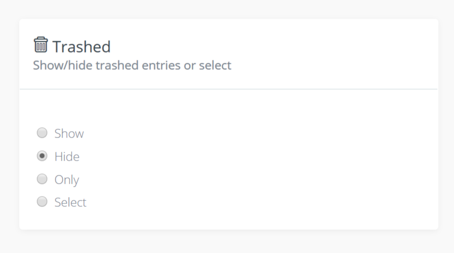

# Soft Deletes

Please refer to the Laravel documentation on how to enable [Soft-deletes](https://laravel.com/docs/eloquent#soft-deleting) for your model.

In your lists you can select how soft-deleted entries are handled

**Show** shows trashed and not-trashed objects

**Hide** hides trashed entries

**Only** only shows trashed elements

**Select** displays a select on the browse-page where your users can select what they want to show, either **show** them, **hide** trashed objects or **only** show trashed entries.


This will work in the same way when a list is used for a relationship **except** that you wont get the select. Make sure to either select **Show** or **Hide**!


