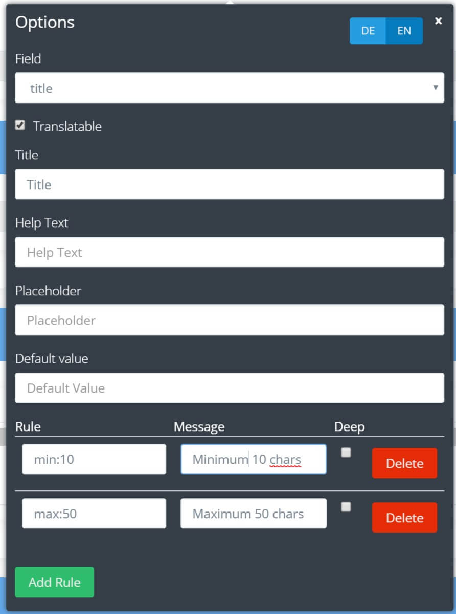
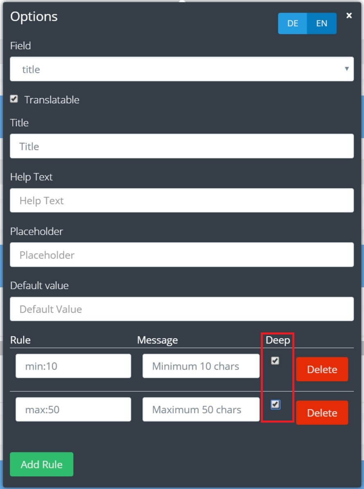

# Validation

BREAD allows you to define validation rules with a breeze.  
First, open the options for the formfield you want to add rules to:

Click `Add Rule` and enter the rule, for example `min:10` and a message to it.  
Messages are translatable. Just click the locale and enter the message in that language.  

You can find a full list of available validation rules in the [https://laravel.com/docs/validation#available-validation-rules](Laravel documentation)!

## Validating translatable fields

By default, only the current locale is validated. If you want to validate each locale, just tick `Deep`:

