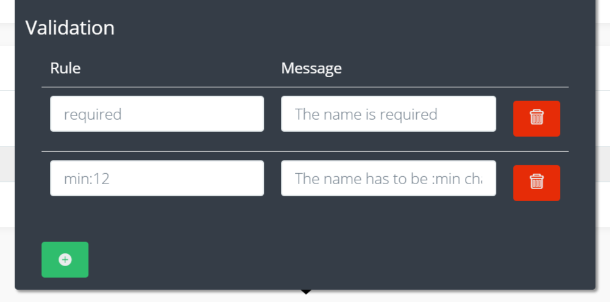

# Introduction

Formfields bring all the functionality to the BREAD-builder and they have a few things in common.

### Field

The field is the column in your database table where the data is stored and read from.  
You want to make sure that you choose a field for every formfield and that you only assign the field once to one formfield.


When you are using [Accessors ](../core-concepts/accessors.md)in Views, please make sure that the accessor-name is either a field, or you defined a [Mutator](https://laravel.com/docs/eloquent-mutators#defining-a-mutator) for it.


### Validation

Here you can enter all your validation rules and messages for this formfield.  
You can find a list of all rules in the [Laravel docs](https://laravel.com/docs/validation#available-validation-rules).

### Translatable options

You can translate all necessary options after you set-up [Translations ](../translations/setup.md)correctly.

