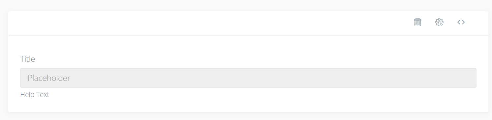

# Number

This input lets you input numbers only.

### Options

#### Default value

This is the default value when editing or adding and entry

#### Placeholder

The placeholder value which is only shown when theres no data in the input

#### Title

This is the title of the input. It is displayed bolder directly above the input

#### Help Text

This text is displayed smaller below the input

#### Prefix

The prefix gets added in front of the value when browsing or reading

#### Suffix

The suffix gets added to the end of the value when browsing or reading

#### Decimals

How many decimals are shown and saved in the database? For example 2 will result in `1.23`

#### Min

The minimum value

#### Max

The maximum value

#### Step

The amount the input should decrease/increase when scrolling up or down. Defaults to 1

